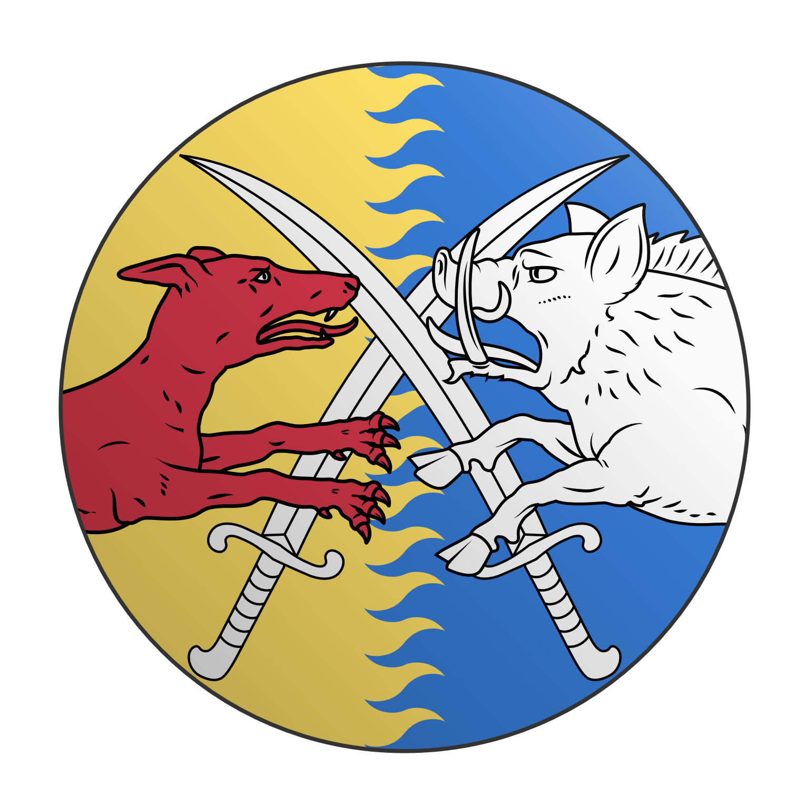
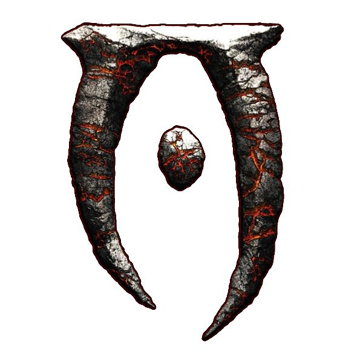
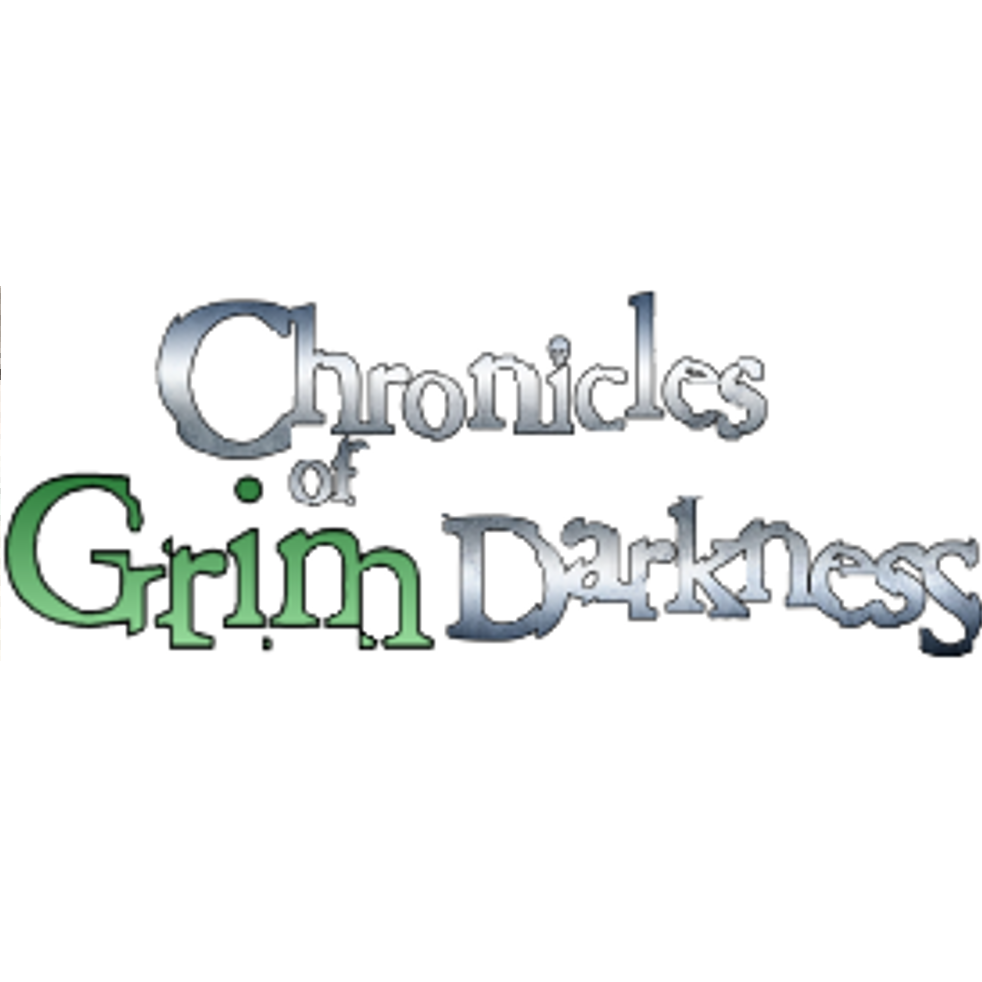

# Vvizarddev Projects Homepage

::: {.retro-panel}
## **VVelcome to the VVizard Caverns.**

Come on in weary traveller. You have arrived safely.

A series of personal projects are linked here. Some are WIPs, some are more or less done. Most make no sense without context.

Enjoy.

-Vvizarddev
:::

::: {.retro-panel}
## Game Zone

### RPG projects
::: {.columns style="justify-content: center; text-align: center;"}

::: {.column width="20%"}
[{width=300px}](https://vvizarddev.github.io/OVariumFortune/)  

#### O Varium Fortune
Medieval adventures in the Anno Nazarene 1400s
:::

::: {.column width="20%"}
[{width=300px}](https://github.com/VvizardDev/TalesOfTamriel/blob/main/Tales%20of%20Tamriel.pdf)  

#### Tales of Tamriel
A Storyteller system hack for the Elder Scrolls IV: Oblivion
:::

::: {.column width="20%"}
[{width=300px}](https://vvizarddev.github.io/CofGD/)  

#### Chronicles of Grim Darkness (🚧 WIP 🚧)
A Storyteller system hack for the FFG 40k RPGs Currently non-human-readable
:::

:::
:::

::: {.retro-panel}
## Random tools

#### [**Solstice Mirror** ☀️](https://vvizarddev.github.io/solstice-mirror/)
A tool to see which day after a solstice is the same length as today.
:::

::: {.retro-panel}
## Da Forum
- [**Vvizard Caverns of the Juul Realms** 🖥️](https://tabletopheaven.proboards.com/)
I basically haven't checked this in two years but have at it. A board full of adventures and posts.
:::
